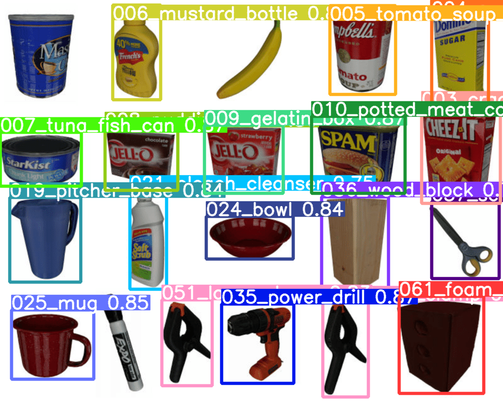
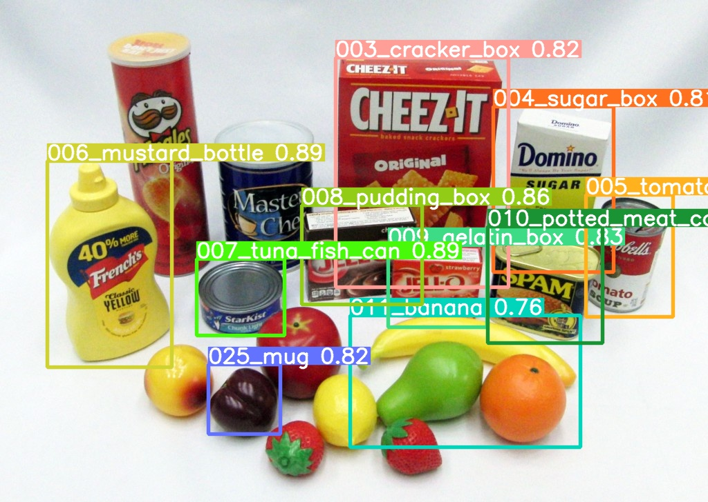
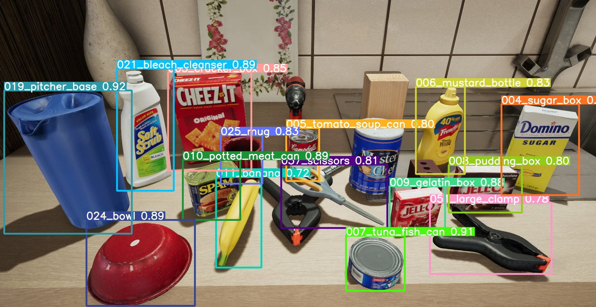

# Prácticas IOC: Detección de Objetos y Análisis de Propiedades
## Joan Saurina

Este repositorio contiene el trabajo realizado para las prácticas del Instituto de Organización y Control (IOC), enfocadas en la identificación de objetos, el análisis de sus propiedades y la detección de su posición utilizando técnicas de aprendizaje profundo y visión por computador.

## Fase I: Pipeline para Identificación de Objetos + Detección de Color.

### 1. Creación y Mejora del Dataset

Inicialmente, se intentó crear un dataset utilizando los frames disponibles en el [repositorio YCB Benchmarks](http://ycb-benchmarks.s3-website-us-east-1.amazonaws.com/). Sin embargo, este enfoque presentó limitaciones significativas:

- Imágenes con un solo objeto
- Fondos no realistas (blancos o neutros)
- Cantidad insuficiente de imágenes
- Perspectivas limitadas, incluso después de la augmentación de datos

Para superar estas limitaciones, se adoptó un dataset más robusto y realista del [YCB Video Dataset](https://chengke.name/ycb-video-dataset-download-mirror/). Este dataset proporciona imágenes anotadas de objetos YCB en escenarios realistas, con un tamaño total de aproximadamente 120GB.

### 2. Arquitectura de Aprendizaje Profundo

Para la detección de objetos, se implementó el modelo YOLO v9, considerado estado del arte (SOTA) en el momento de realización del proyecto. La implementación se basó en el [repositorio oficial de YOLO v9](https://github.com/WongKinYiu/yolov9).

### 3. Entrenamiento y Optimización

El modelo YOLO v9 fue entrenado y optimizado utilizando el dataset YCB mejorado, con un enfoque en evitar el sobreajuste mediante técnicas de augmentación de datos, y provando de encontrar los hiperparámetros óptimos que fueron los utilizados para el entrenamiento definitivo.

### 4. Validación de Resultados

Se realizaron experimentos con objetos reales en el laboratorio para validar la eficacia del modelo entrenado en la detección de objetos YCB.

### 5. Detección y Análisis de Color

Se ha desarrollado un pipeline robusto y eficiente para la detección y análisis de color de los objetos identificados. Este proceso consta de varias etapas interconectadas que aprovechan técnicas avanzadas de visión por computador y aprendizaje profundo:

#### 5.1 Detección de Objetos y Consulta Ontológica

- Se utiliza el modelo YOLO v9 previamente entrenado para detectar objetos en la imagen.
- Para el objeto detectado, se realiza una consulta a una ontología predefinida para obtener información sobre la cantidad esperada de colores.

#### 5.2 Extracción de Regiones de Interés

- Se recorta la imagen original utilizando las coordenadas del bounding box proporcionadas por YOLO v9.
- Este paso permite aislar cada objeto para un análisis más preciso y eficiente.

#### 5.3 Segmentación Semántica

- Se implementa el modelo [Segment Anything](https://github.com/facebookresearch/segment-anything) para una segmentación semántica de alta precisión.
- Este paso genera máscaras detalladas para cada objeto, permitiendo una separación precisa del objeto y el fondo.

#### 5.4 Análisis de Color mediante K-means

- Se aplica el algoritmo K-means sobre las regiones segmentadas para identificar los colores dominantes.
- El número de clusters (k) se ajusta dinámicamente basándose en la información obtenida de la ontología en el paso 5.1.
- Este enfoque permite una detección precisa de los colores exactos presentes en el objeto, incluso en casos de objetos multicolor o con patrones complejos.

Esta pipeline integrada proporciona una solución completa para la detección y análisis de color de objetos en imágenes, combinando técnicas de vanguardia en detección de objetos, segmentación semántica y análisis de clusters. La flexibilidad del sistema permite su adaptación a diversos escenarios y tipos de objetos, garantizando resultados precisos y fiables.

## Fase II: Pipeline para Estimación de Pose

### 1. Arquitectura para Estimación de Pose

La implementación de la estimación de pose se desarrolló siguiendo un proceso iterativo de investigación, experimentación y optimización:

#### 1.1 Selección de la Arquitectura

Tras una exhaustiva investigación y evaluación de diversas opciones, se optó por la arquitectura [Deep Object Pose Estimation (DOPE)](https://github.com/NVlabs/Deep_Object_Pose). Esta elección se basó en varios factores:

- Casos de éxito documentados
- Implementación en PyTorch
- Estado del arte en el momento del proyecto
- Ventajas sobre alternativas como PoseCNN

#### 1.2 Generación del Dataset Inicial

Se construyó un dataset sintético siguiendo las directrices del proyecto DOPE:

- Utilización de modelos 3D de objetos YCB previamente entrenados con YOLO
- Incorporación de distractores 3D para aumentar la complejidad de las escenas
- Uso de mapas HDRI proporcionados por los autores para iluminación realista
  [Enlace a los mapas HDRI](https://drive.google.com/file/d/1lp36MgTlS4OFaH0vdsTFhyGFJpQDY2YX/view)

El dataset inicial constaba de 20,000 imágenes generadas sintéticamente.

#### 1.3 Primer Intento de Entrenamiento y Optimización

Los resultados iniciales no fueron satisfactorios, lo que llevó a las siguientes mejoras:

1. Expansión del dataset: De 20,000 a 75,000 imágenes
2. Ajuste de las dimensiones de imagen: De 1920x1080 a 512x512 para optimizar el rendimiento de la red
3. Aumento del tamaño de los objetos objetivo en las imágenes

Estas modificaciones mejoraron los resultados, pero aún no alcanzaron un nivel satisfactorio de precisión.

#### 1.4 Incorporación de Dataset Realista

Para abordar las limitaciones del dataset sintético, se integró el dataset FAT (Falling Things) de NVIDIA:
[FAT Dataset](https://research.nvidia.com/publication/2018-06_falling-things-synthetic-dataset-3d-object-detection-and-pose-estimation)

Este dataset, utilizado en el paper original de DOPE, se combinó con los datos sintéticos generados previamente. Sin embargo, esta adición no produjo una mejora significativa en los resultados.

#### 1.5 Análisis de Limitaciones

Los resultados subóptimos se atribuyen principalmente a dos factores:

1. **Método de generación de datos sintéticos:**
   - El método original descrito en el paper está obsoleto y requiere versiones antiguas de Ubuntu y drivers de NVIDIA.
   - El nuevo método de generación de datos no parece producir resultados de la misma calidad que el original.

2. **Robustez del método DOPE:**
   - Se han observado quejas en los issues de GitHub sobre malos resultados y problemas de convergencia.
   - El método parece no ser determinista, lo que dificulta la reproducibilidad de resultados de alta calidad.

#### 1.6 Conclusiones y Trabajo Futuro

Estos hallazgos sugieren la necesidad de:

1. Una revisión y actualización por parte de los autores del método de generación de datos sintéticos.
2. Una investigación más profunda sobre la estabilidad y reproducibilidad del método DOPE.
3. Exploración de arquitecturas alternativas o métodos híbridos para la estimación de pose que puedan ofrecer resultados más consistentes y precisos.

## Código y Guía de Uso

### 1. Modelo YOLOv9 para Detección de Objetos

#### Configuración Inicial
1. Clone el repositorio de YOLOv9 en el directorio principal del proyecto.

2. Descargue los pesos pre-entrenados `yolo_ycb.pt` y colóquelos en la carpeta `weights` del repositorio clonado.

#### Ejecución del Modelo
Desde la carpeta `object_detection`, ejecute el siguiente comando:

```python main.py <img_size> <conf> <device> <weights> <source_folder> <project>```

Donde:
- `<img_size>`: Tamaño de la imagen de entrada (ej. 640)
- `<conf>`: Umbral de confianza para la detección (ej. 0.25)
- `<device>`: Dispositivo de ejecución ('cpu' o 'cuda')
- `<weights>`: Ruta a los pesos del modelo (ej. '../weights/yolo_ycb.pt')
- `<source_folder>`: Carpeta con las imágenes de entrada
- `<project>`: Carpeta de salida para los resultados

#### Detección en Tiempo Real
Para una versión dinámica en tiempo real, se ha preparado el script `webcam_modified.py` que utiliza la librería OpenCV. 

**Nota:** Este script no se pudo probar debido a limitaciones en las cámaras del laboratorio. Asegúrese de tener una cámara compatible antes de ejecutar.

#### Ejemplos de Uso

Para demostrar el funcionamiento del sistema, hemos incluido tres imágenes de prueba en la carpeta `images` del repositorio. A continuación, se presentan los resultados obtenidos para cada una de ellas.








### 2. Modelo YOLOv9 + Detección de Color

#### Configuración Inicial

1. Clone el repositorio de Segment Anything en el directorio principal del proyecto.

2. Descargue los pesos pre-entrenados `sam_small.pt` y colóquelos en la carpeta `weights` del repositorio clonado.

#### Ejecución del Modelo

Ejecute modelo YOLOV9 para tener la bounding box del objeto.
Desde la carpeta `color_detection`, ejecute el siguiente comando:

```python color.py <bounding_box> <path_image> <número_colores_ontología>```


